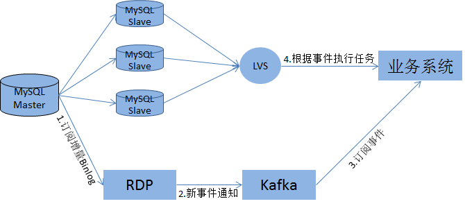
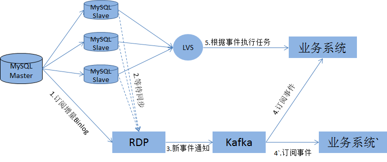
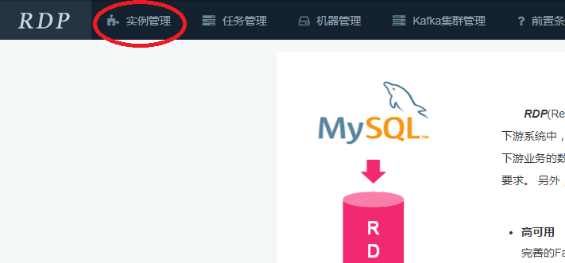
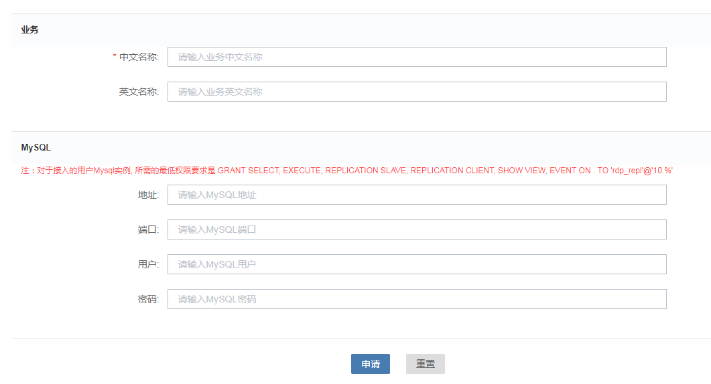

# RDP快速开始
## 1. RDP简介
数据订阅服务RDP(Real-time Data Pipeline)

- 我们不生产数据，我们只是数据搬运工

RDP同步数据库Binlog数据，经事务边界解析、Binlog翻译、过滤、分包、压缩、打包等操作，最终生成Protobuf格式序列化数据，推送至下游消息系统。

RDP系统架构图如下：


 - 数据源：RDP模拟Slave的同步方式，加入数据库的同步结构，既可以作为Master的Slave，也可以作为Slave的Slave。支持的数据库版本包括MySQL(version>5.7.19)，MariaDB(version>10.0.21).
 - Zookeeper：通过Zookeeper进行选主，在异常时自动进行主从切换，保证持续服务。定时记录同步进度，加快服务恢复。
 - RDP：主从多节点模式，多线程并发解析Binlog，保证数据实时性。
 - Schema Store & Execute DB：Schema Store存储源数据库表结构镜像，Execute DB回放DML，每个RDP对应一个轻量级的数据库，用于回放Binlog中的DML，将Binlog对应的表结构存储于Schema Store，降低对Schema Store的操作。计算和存储分离，这样多个RDP共享一个高性能的Schema Store。
 - Kafka：RDP使用原生Kafka协议写到单个Topic单个Partition，保证数据顺序。(对于需要对分片数据库合并到一个Topic，建议不同分片数据库写到同一个Topic的不同Partition)。


## 2. RDP的应用场景

 - 数据同步：同步数据库Binlog数据，解析后写入VMS，业务消费VMS获取数据库增量数据。


 - 事件通知：通过RDP同步增量数据库数据至VMS，业务消费VMS，获取DataBase/Table/Column/Value的变动情况。



 - 读一致性事件通知：RDP会主动等待Slave的同步进度，等待指定Slave追上同步进度或者超过一定阈值，才将事务写到Kafka。



## 3. 接入要求

1.MySQL版本要求>=5.7.19, MariaDB>=10.0.21

```
# MySQL
mysql> select @@version;
+------------------+
| @@version        |
+------------------+
| 5.7.17-debug-log |
+------------------+
1 row in set (0.00 sec)

# MariaDB
mysql> SELECT @@GLOBAL.VERSION;
+---------------------+
| @@GLOBAL.VERSION    |
+---------------------+
| 10.0.21-MariaDB-log |
+---------------------+
1 row in set (0.01 sec)
```

2.确保开始GTID(不开启GTID也可以，但在MySQL主从切换时可能存在丢数据情况)。MariaDB版本没有GTID_MODE项，不需要检查。

```
mysql> SELECT @@GLOBAL.GTID_MODE;
+--------------------+
| @@GLOBAL.GTID_MODE |
+--------------------+
| ON                 |
+--------------------+
1 row in set (0.00 sec)
```

3.确保开启Row格式LOG_BIN

```
mysql> SELECT @@GLOBAL.LOG_BIN;
+------------------+
| @@GLOBAL.LOG_BIN |
+------------------+
|                1 |
+------------------+
1 row in set (0.00 sec)
```

4.确保BINLOG_FORMAT为ROW格式

```
mysql> SELECT @@GLOBAL.BINLOG_FORMAT;
+------------------------+
| @@GLOBAL.BINLOG_FORMAT |
+------------------------+
| ROW                    |
+------------------------+
1 row in set (0.00 sec)
```

5.确保BINLOG_ROW_IMAGE为FULL。MariaDB版本没有BINLOG_ROW_IMAGE项，不需要检查。

```
mysql> SELECT @@GLOBAL.BINLOG_ROW_IMAGE;
+---------------------------+
| @@GLOBAL.BINLOG_ROW_IMAGE |
+---------------------------+
| FULL                      |
+---------------------------+
1 row in set (0.00 sec)
```

6.提供如下权限的用户

```
mysql> select Host, Select_priv, Execute_priv, Repl_slave_priv, Repl_client_priv, Show_view_priv, Event_priv from mysql.user where user='rdp'\G
*************************** 1. row ***************************
              Host: 10.%
       Select_priv: Y
      Execute_priv: Y
    Repl_slave_priv: Y
Repl_client_priv: Y
    Show_view_priv: Y
        Event_priv: Y
1 rows in set (0.00 sec)

# 如果没有相应权限用户可以通过一下语句创建
GRANT SELECT, PROCESS, REPLICATION SLAVE, REPLICATION CLIENT, SHOW VIEW, EVENT ON *.* TO 'rdp'@'10.%' identified  by  ...;
# 其中,  上述grant语句中"..."表示密码, 上述grant产生了一个具有拉取binlog权限的用户.
```

## 4. 接入流程
1.登录RDP OSS系统

2.点击“实例管理”



3.点击“实例申请”


4.填写业务信息，业务DB信息



5.联系RDP团队，RDP团队会与业务人员一起评估资源需求、部署方案、上线计划等。