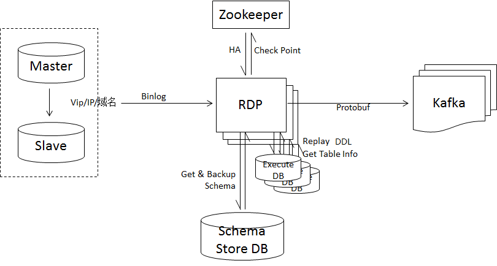

# RDP性能测试报告

从上面RDP系统架构图可以看出，RDP性能主要受限于以下几个方面：

1. 源数据库到RDP的网络性能
2. RDP到Kafka集群的网络性能
3. Kafka集群的写入性能

本测试不考虑网络间性能问题，不对源数据库和Kafka集群进行优化。使用sysbench操作源数据产生Binlog数据。

## 1. RDP性能测试

TPS：每秒内处理完成的事务数。

EPS：每秒内处理完成的Binlog 事件数。

### 1.1 实时数据测试

测试时长30分钟，源数据库到写入Kafka集群处理时延在1ms内。

|      | 平均值 | 最大值 | 最小值 |
| ---- | ------ | ------ | ------ |
| TPS  | 29066  | 29912  | 28140  |
| EPS  | 145331 | 149564 | 140701 |
| 时延 | <1ms   | <1ms   | <1ms   |

### 1.2 离线/存量数据测试

|      | 平均值 | 最大值 | 最小值 |
| ---- | ------ | ------ | ------ |
| TPS  | 28698  | 31094  | 27008  |
| EPS  | 143495 | 155470 | 135044 |
| 时延 | <1ms   | <1ms   | <1ms   |

### 1.3 测试结论

通过对RDP进程分析，实时数据流与离线/存量数据流的测试场景下，同步MySQL的数据线程占用CPU都已经差不多100%，所以两测试结果数据相差不大。对事务的处理TPS约29000事务/秒，对事件的处理EPS约144000事件/秒。